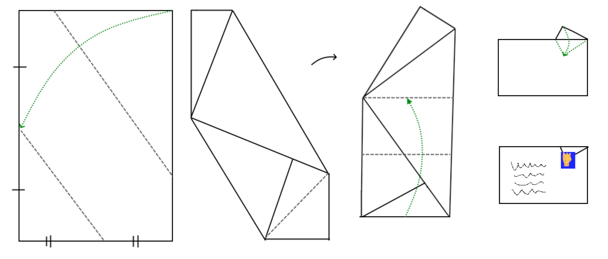
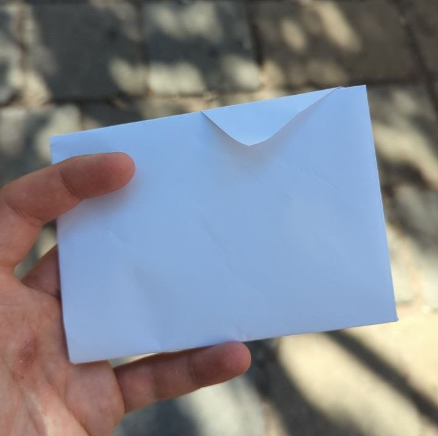

# Folding an A4 sheet into its own envelope

I like sending post. A lot. Snail mail is full of intrigue, fun, and wonder.

Here is a nice way of folding a piece of A4 paper into an self-contained envelope. It folds in such a way that you can use the postage stamp to keep it closed.

The single- and double-lines on the first image represent equal width sections. To find the middle of these, you can pinch the left and bottom edge in half.

Here is an example, folded by a friend:

Credit where credit is due, I stole the idea from <https://pigeonposted.com/>, and made the diagram myself. They do the folding with specifically printed patterned paper, but it's just as tenable to do it with plain, or non-specific patterned paper.

Or use a map.

Or use anything.

Send post! We love it.

## Textual description

I originally wrote this description as alt-text of the image above.

> start with a vertical A4 page. all folds are towards the viewer.
>
> image 1:
>
> 1. fold top right corner to midpoint of left edge
> 2. fold with fold-line running from left edge midpoint to bottom edge midpoint
>
> image 2:
>
> 1. fold bottom right corner up into gap where it will fit nicely
>
> image 3:
>
> 1. rotate paper clockwise by around 30 degrees so that it is square
> 2. fold (new) bottom edge up so that left corner joins the top leftmost corner
> 3. fold topmost corner over the previous fold
>
> image 4:
>
> 1. fold topmost corner which now sticks above small rectangle over the rectangle
>
> image 5:
>
> 1. an envelope contruction, with address, and stamp over the flap holding it together
