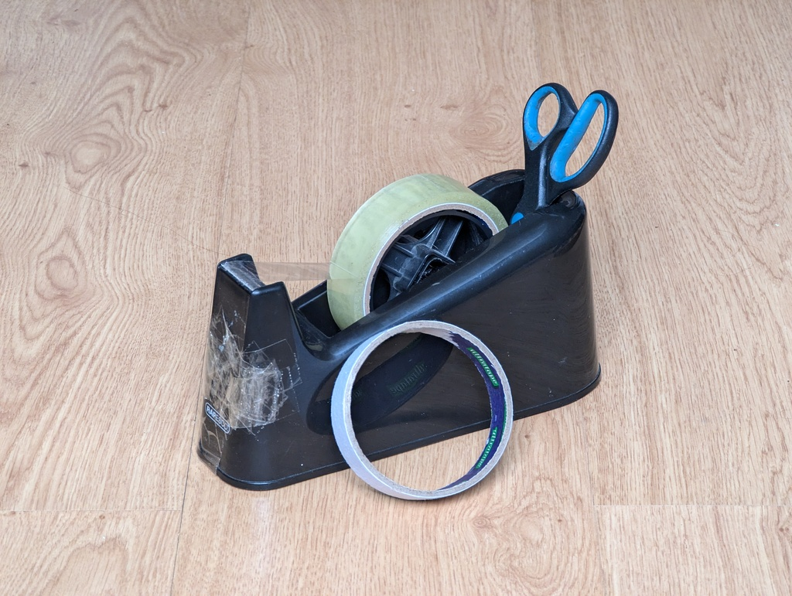
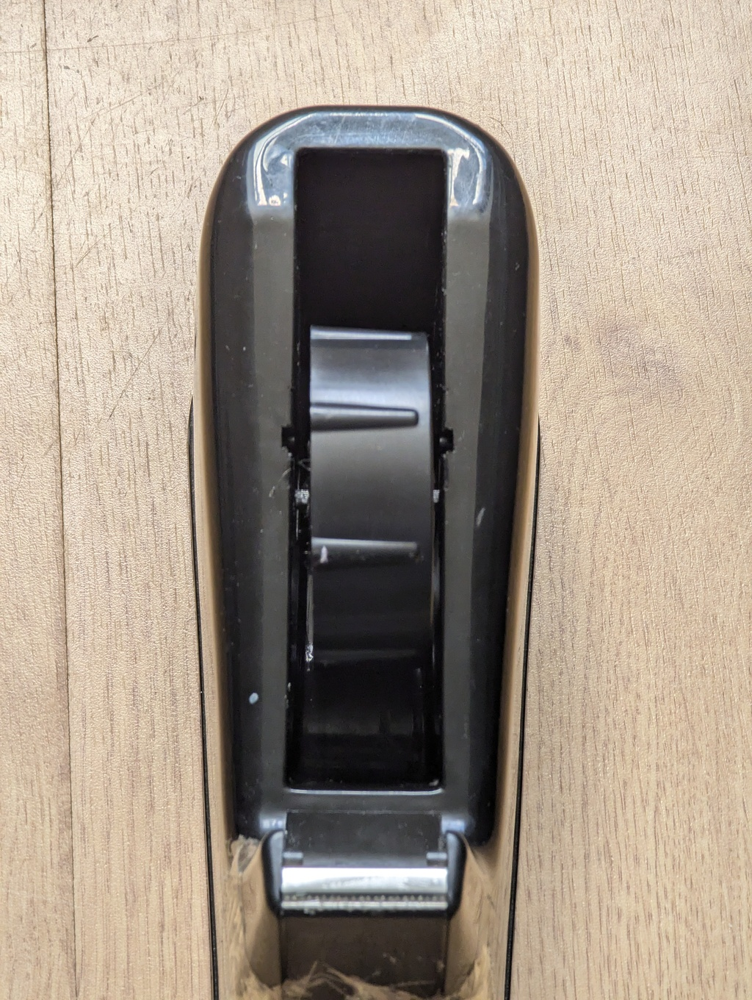
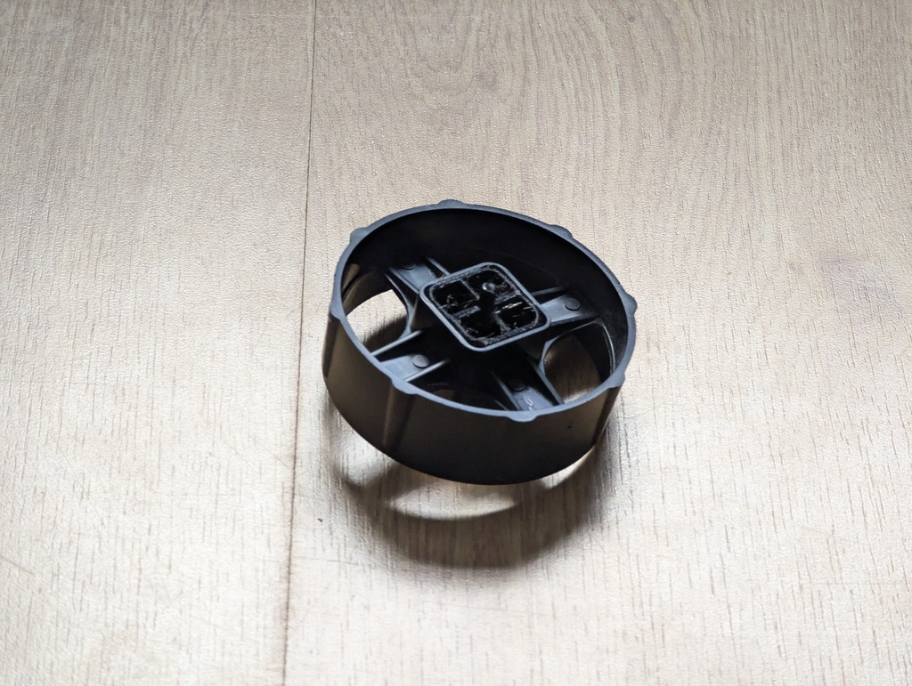

# My sellotape dispenser and the repairs therein

<https://github.com/alifeee/rapesco-500-sellotape-dispenser-core>

preview (in 3D!) on <https://github.com/alifeee/rapesco-500-sellotape-dispenser-core/blob/main/Tape%20Roller.STL> or by downloading [the file](./Tape%20Roller.STL) and viewing on <https://www.viewstl.com/> or <https://3dviewer.net/> (or googling "STL viewer online")

thanks, Diver Dan

thanks, John
