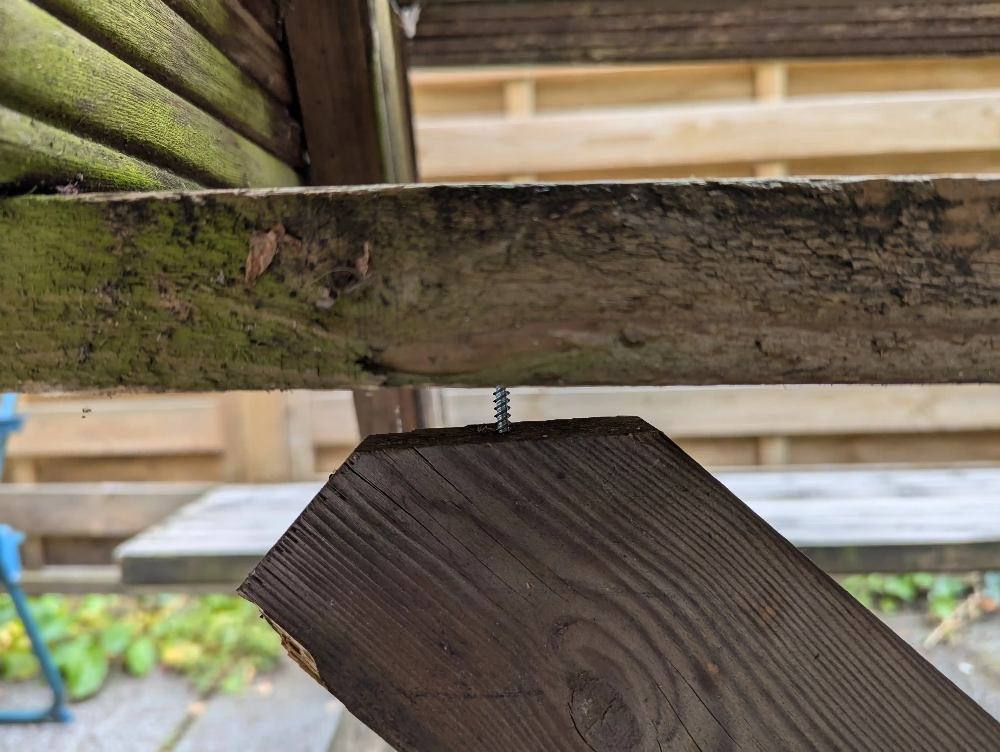
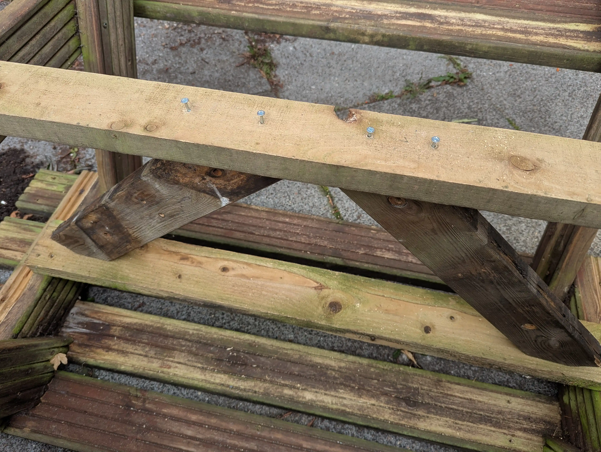
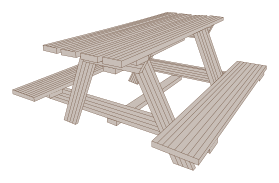

# Stabilising our wobbly bench

Check out this wobbly bench:

<video controls="" preload="none" loop="" crossorigin="anonymous" poster="./images/bench3_PREVIEW.webp" style="max-height: 20rem;">
  <source src="./images/bench3.webm" type="video/webm">
</video>

Now check out what it looks like now:

<video controls="" preload="none" loop="" crossorigin="anonymous" poster="./images/bench4_PREVIEW.webp" style="max-height: 20rem;">
  <source src="./images/bench4.webm" type="video/webm">
</video>

I spent this afternoon adding two diagonal support struts to minimise the wobble. It worked better than I thought it would!

It was mostly a patch job – the bench isn't exactly high-quality – so they're not amazingly sized up (there is a big air gap):

…but, it's stable enough for me!

Putting it together involved:

- a lot of turning the bench upside-down
- finding a few completely rounded screws that I couldn't remove — instead I worked around them
- using a very blunt saw to cut the diagonal struts
- holding some things at some quite inconvenient angles (I could have well-used an assistant)
- breaking a couple of drill-bits (one because of its low-quality [it was from the middle-of-Aldi] and the other because of weird drilling angles due to the aforementioned completely rounded screw)

If I did it again, I'd like to have:

- a better (sharper) saw
- measured up the struts better
- an assistant

Here are some more pictures of the – to be honest, almost rotting – bench.

<figure class="gallery">

</figure>

The support struts are cut from another bench that I found discarded on the street and disassembled for wood. One man's trash.

Finally, here's a nice SVG rendition of the bench (pre-struts). I traced it using Inkscape.

I hope it can continue to keep me and my housemates comfortable eating our alfresco teas.
