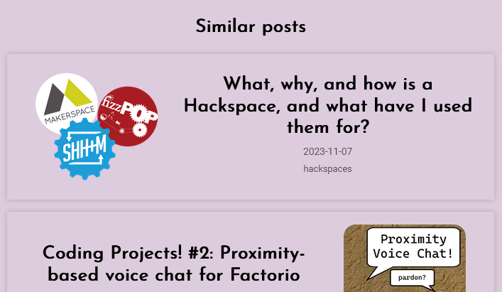

# alifeee's blog

This repo contains blog stuff that I write, as well as any code used to generate it. It can be found on [`blog.alifeee.co.uk`](https://blog.alifeee.co.uk)

## Markdown

Markdown parsing is done using [`markedjs`](https://marked.js.org/). Install and use it using:

```bash
# install
npm install -g marked
# use
marked file.md
```

...then I put the generated HTML into the file manually or use [a script](./2024/09/sellotape-dispenser/build.sh).

To add anchor link IDs, add the [`marked-gfm-heading-id`](https://github.com/markedjs/marked-gfm-heading-id) extension using:

```bash
npm install -g marked-gfm-heading-id
# add heading ID extension
#   import { gfmHeadingId } from "marked-gfm-heading-id";
#   marked.use(gfmHeadingId());
# to add to CLI:
sed -i '/import { marked } from /a import { gfmHeadingId } from "marked-gfm-heading-id";\nmarked.use(gfmHeadingId());' /usr/alifeee/.nvm/versions/node/v20.18.0/lib/node_modules/marked/bin/main.js
```

## RSS Feed

An RSS feed is generated using [Python](./utilities.py/rss_feed.py) via [workflow](./.github/workflows/rss.yml). You can find (and subscribe to it) here: <https://blog.alifeee.co.uk/feed.xml>.

## Similar posts

After every blog post there are a few "similar posts". The HTML for this section is automatically generated by the [similar_posts.yml workflow](./.github/workflows/similar_posts.yml) using the [embeddings.py](./utilities.py/embeddings.py) Python script. The way this is done is inspired by [Tom Hazledine's](https://tomhazledine.com) post: [TomBot2000: automatically generating related posts using LLMs](https://tomhazledine.com/llm-related-posts/). It uses OpenAI to generate a text embedding for each post and ranks them by similarity. The recommendations should update as new blog posts are posted.


