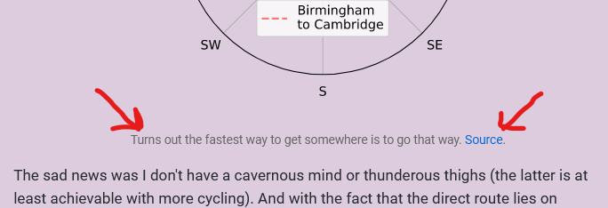
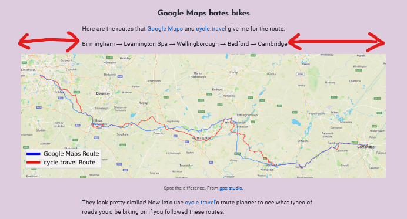

# alifeee's blog

This holds any blog content I decide to write, as well as any code used to generate it. It can be found on [`alifeee.co.uk/blog`](https://alifeee.co.uk/blog) (some day I might figure out how to get `blog.alifeee.co.uk` to work).

## Markdown

Markdown parsing is done client side using [zero-md](https://github.com/zerodevx/zero-md). This is to avoid using a build step.

```html
<head>
    ...
  <script
    type="module"
    src="https://cdn.jsdelivr.net/gh/zerodevx/zero-md@2/dist/zero-md.min.js"
  ></script>
  ...
</head>
<body>
  ...
  <zero-md src="/example.md"></zero-md>
  ...
</body>
```

### Markdown extensions

#### Figure captions

The HTML `figcaption` element is styled to serve as an image caption. Note, for Markdown to parse inside this, it must be on a newline:

```md


<figcaption>

Turns out the fastest way to get somewhere is to go that way. [Source](https://xkcd.com/179/).

</figcaption>
```



#### Wide images

If you append `#wider` to the `src` of an `img` tag, it gets made wider than the max-width of the content (default to 60rem).

```md

```



## Email Subscription

<https://www.tinyletter.com/> is used for email subscriptions.

Newsletter: <https://tinyletter.com/alifeee>

App: <https://app.tinyletter.com/>

## Python utilities

| File | Description |
| --- | --- |
| `footer.py` | Replaces `<div class=links>` in each HTML footer with the right links. |
| `toc_markdown.py` | Generates a table of contents for a Markdown file. |
| `verify_og.py` | Checks that all Markdown files have the right OpenGraph tags. Not actually automated, just prints out the OpenGraph tags. |
