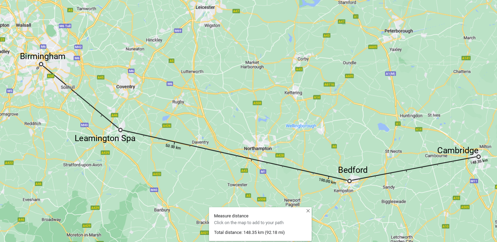
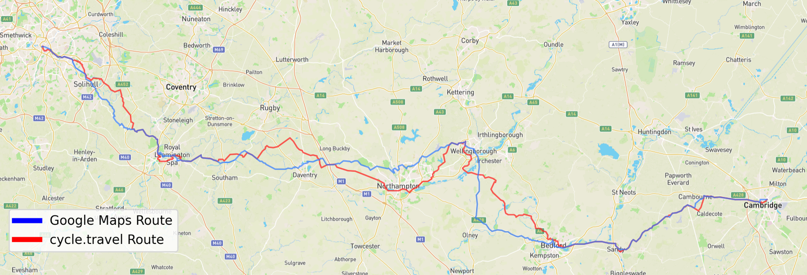

# I biked from Birmingham to Cambridge (a tribute to National Cycle Routes)

1. [Technicalities - how far *did* I bike?](#technicalities---how-far-did-i-bike)

1. [How to plan a bike route](#how-to-plan-a-bike-route)

    1. [Google Maps hates bikes](#google-maps-hates-bikes)

1. [National Cycle Routes!](#national-cycle-routes)

    1. [Why get lost when you can not get lost](#why-get-lost-when-you-can-not-get-lost)

    1. [Do they go the right way?](#do-they-go-the-right-way)

    1. [Why go the right way when you can go the wrong way](#why-go-the-right-way-when-you-can-go-the-wrong-way)

1. [Conclusion ("And what?")](#conclusion-and-what)

1. [Appendix: Tools](#appendix-tools)

In April, I biked from Birmingham to Cambridge.

More accurately, I half-biked, half-trained from Birmingham to Cambridge.

The original plan was to be on the bike the whole way, from Birmingham to Leamington Spa, to Wellingborough, through Bedford, and finally into Cambridge (it may sound a haphazard route, but I'd managed to find someone who would host me at each town!). This route was half on established cycle routes, and half country roads where I'd have to find my own way. Not bad, but it might be annoying to navigate on roads which were completely new to me.

But then... why should I have to bike on unlabelled routes and terrible roads? Why am I biking in the first place? Ultimately:

- Because I can,
- It sounds fun,
- I've always wanted to go on a bike tour and this is almost that

Therefore, why bother with a convoluted and annoying bike just for the sake of having biked the whole way. Let's ditch the idea of "purity"... and just catch a few trains to make it more pleasant. Here was the final route:

<figcaption>

Look ma! I did most of it with my own legs!
[Source][notebook: route].

</figcaption>

In an ideal world, I would have biked closer to Cambridge, but I injured my foot just before the final day, so I couldn't. Hence, the horrific detour by train! (turns out, the Bedfordshire council *does not* let you take a bike onto their buses)

So, what's the rest of this post about? Basically...

- Alternatives to Google Maps for finding a bike route
- Me using the opportunity of having data to make pretty graphs with Python
- Why you should cheat if you go on a bike ride

## Technicalities - how far *did* I bike?

As the crow flies, the distance from my house to where I ended up in Cambridge is 141.1 km.
If said crow got tired and wanted to stop off at the same places I stopped off, the distance would be 148.4 km (thanks to my friend trigonometry for such a small change.)

<figcaption>

If I were a crow, it would be a nice life.
I would also get to Cambridge in 148 km, with stopovers.
From [Google Maps].

</figcaption>

According to my records, I biked 150.3 km. That's more than 148.4 km!

I'm better than a crow! Or, I can (in the most roundabout of technicalities) now say:

"I biked the distance from Birmingham to Cambridge!"

That sounds pretty good! I'll start telling people that, and they'll be none the wiser.

Since this seems to be the section with all the statistics, let's finish off with the rest of them:

| Statistic | Value |
| --- | --- |
| Crow-distance from Birmingham to Cambridge | 141.1 km |
| Sleepy crow-distance from Birmingham to Cambridge | 148.4 km |
|||
| Distance I biked | 150.3 km |
| Total time cycling | 11hr 54min |
| Total climb | 746 m |
| Average speed | 12.6 km/h |

<figcaption>

</figcaption>

## How to plan a bike route

Before this, I'd not planned a very long bike ride before. I had biked from Durham to Newcastle, but that's basically a straight shot up the A167 until you find a "Newcastle Road" that you can follow. The biggest gripe I remember from this and other long-ish rides was that the directions [Google Maps] gave me were: not great for biking; and took *way* longer than the estimate said. These are basically encapsulated in what I will call my "top 2 criteria for a perfect bike route":

1. I don't want to bike on roads unfriendly to bikes (I think I should be allowed to desire to not be run over by a car)
2. I don't want to stop to check my phone for directions (I'm afraid I'm not bourgeois enough to have one of those fancy phone holders on my handlebars)

I ended up finding a great website for finding any distance bike routes: [cycle.travel]. As well as actual bike-friendly routes (which are, naturally, slightly longer than Google's suggestions but ten times more pleasant to bike on), the website provides some information about the type of roads on the route. This solves the first problem above, and also how I figure that...

### Google Maps hates bikes

Here are the routes that [Google Maps] and [cycle.travel] give me for the route:

Birmingham → Leamington Spa → Wellingborough → Bedford → Cambridge

<figcaption>

Spot the difference.
From [gpx.studio].

</figcaption>

They look pretty similar! Now let's use [cycle.travel]'s route planner to see what types of roads you'd be biking on if you followed these routes:

<figcaption>

Which of these would *you* rather bike on?
[Source][notebook: maps vs cycle.travel].

</figcaption>

Now personally, 2 of these 5 road types I find enjoyable to bike along, and the other three far less so. I'll leave it to you to imagine which. Needless to say, the directions Google gives you are *not* made for cycling.

Additionally, [Google Maps] seems to think that you are some kind of cycling God, presumably decked out with Lycra, speed stripes, and one of those back-pockets. I say this because the time estimate it gives you expects you to be cycling **19.1 km/h**. If you aren't acutely aware of the relative speeds of biking, what are you doing with your life. But, if not, I would describe this as "very fast". To contextualise: over three days, I managed an average of 12.6 km/h, and going what I felt was a moderate speed I would get to about 15 km/h. Meanwhile, [cycle.travel]'s travel time estimates estimate that you are doing around 15.8 km/h. Much more reasonable. (though I *personally* still have to add an hour to any time estimates. What can I say, I love dawdling.)

So, [cycle.travel] (or probably many other cycling websites) solves my first bike route desire: I don't want to be run over. How do we solve the second: I don't want a SatNav?

## National Cycle Routes!

Biking can be very pleasant when it's relaxing and stress-free (see: when there are no cars). National Cycle Routes are exactly that! They are a network of paths, roads, and bridges through the UK which are kept navigable, and they are all very well signed.

> The National Cycle Network is a UK-wide network of signed paths and routes for walking, wheeling, cycling and exploring outdoors.

\- [Sustrans][national cycle network]

The goal of national cycle routes is to make it pleasant to bike on them. As I have expressed, the main goal of this whole adventure was also to have an enjoyable time, so why not use national cycle routes as much as possible!

<figcaption>
Ramp down to the Stratford canal, National Cycle Route 5.
</figcaption>

### Why get lost when you can not get lost

One of my favourite things about the routes is that they are very well signed. [Sustrans] do a great job keeping them up to date and making any diversions obvious. Set off down a route, and you'll encounter a familiar blue and red sign at every turn keeping you on track. This pretty neatly deals with my "I don't want to stop for directions" criterion.

If you blindly follow the routes, you will end up skirting round villages and past large roads in long, winding, or counterintuitive diversions, but you'll also end up encountering what you might not if you try and zoom through everywhere that you visit via the fastest route possible.

<figcaption>

Whoosh!
Picture from a bridge next to the ford.
Would've been fun to try and get through on a bike though.

</figcaption>

There is a definite comfort in knowing that you're on the right track. If I weren't, then after every turn I'd feel the need to check if I'm going the right way, so I don't end up careening down a hill for ten minutes only to find I've made a wrong turn and all the freewheeling fun was for nothing.

<figcaption>

Get to the end of this, but a thousand times, and you might end up in Cambridge.

</figcaption>

### Do they go the right way?

No.

The national cycles routes come with the problem that they might simply not align with where you want to go. That was certainly the case for me. You try and find a good way from Birmingham to Cambridge that doesn't end up in a huge detour of a winding mess.

<figcaption>

Here's a game. Why does everything go the wrong way?
Sorry, that wasn't a game.
From [OS Maps].

</figcaption>

However, for me, biking along a cycle route offers too many benefits in contrast to the alternative: making sweeping shortcuts across Northamptonshire.

### Why go the right way when you can go the wrong way

If my mind was cavernous and my thighs thunderous, I would be able to set off and bike straight towards Cambridge. Stopping only to sleep, this is the overall direction I would end up going in, thanks to petty limitations of the real world like "roads don't go in perfectly straight lines":

<figcaption>

Turns out the fastest way to get somewhere is to go that way.
[Source][notebook: directionality].

</figcaption>

The sad news was I don't have a cavernous mind or thunderous thighs (the latter is at least achievable with more cycling). And with the fact that the direct route lies on approximately zero national cycle routes, it did not seem a good way to go. However! There was a solution! Trains! I could just hop on a quick 30-minute train and re-align myself with the curious spider web of cycleways. I just had to find out when and where I could do that, which is where the National Rail route map comes in:

<figcaption>

An insight into my definitely organised mind:
what I sketched to see which trains I could use on my journey if I needed to.
Blue is the bike route, with green the trains that could be used as shortcuts.
Background from [National Rail](https://www.nationalrail.co.uk/stations_destinations/rail-maps.aspx) ([PDF](./data/Rail%20map%20v37%20orange%20Dec%2022.pdf)).

</figcaption>

I ended up doing a completely different route which goes off both the top *and* bottom of that map, but it planted the seed that trains were only here to help.

<figcaption>

I'm big. My bike is big.
Sometimes we fit in a train.

</figcaption>

If we look back at the route I finally did, I ended up on national cycle routes for *the whole thing*.

<figcaption>

It's all national cycle routes?
Always has been.
[Source][notebook: route].

</figcaption>

This ended up meaning that some days I was biking not towards Cambridge at all, which - if I were only biking - would usually mean zero progress towards the end. But not so bad here! It's easily fixable with a train or two.

<figcaption>

Going the right way is for nerds.
[Source][notebook: directionality].

</figcaption>

## Conclusion ("And what?")

To me, my journey counts as a bike tour. I will also say: bike touring is fun! You have one thing to do: bike. Go forwards. Head empty. Eat snack. Pedal.

Also, let's not be purist. Trains make it so much better. You can pick and choose the best bike routes, all while retaining the feeling of slow progress towards your destination.

10/10 would bike again.

<figcaption>

My bike in front of [millennium milepost 897X](https://www.sustrans.org.uk/national-cycle-network/millennium-mileposts).
6 km into day 2, the 80 km day.

</figcaption>

## Appendix: Tools

Here are a few tools I used to get data from the bike ride, and subsequent GPS data:

- Planning routes - [cycle.travel]
- View all the National Cycle Routes - [OS Maps]
- Recording routes - [OS Maps]
- Viewing route GPX data - [gpx.studio]

You can also view the data analysis in the [GitHub repository](https://github.com/alifeee/blog/tree/main/bike-to-cambridge)! In particular, check out these Jupyter notebooks:

- [route.ipynb][notebook: route]
- [maps_vs_cycleroutes.ipynb][notebook: maps vs cycle.travel]
- [directionality.ipynb][notebook: directionality]

You can open and play with these notebooks on [Binder][notebooks: binder].

[cycle.travel]: https://cycle.travel
[Google Maps]: https://google.com/maps
[Sustrans]: https://www.sustrans.org.uk/
[national cycle network]: https://www.sustrans.org.uk/national-cycle-network
[OS Maps]: https://explore.osmaps.com/
[gpx.studio]: https://gpx.studio/

[notebook: route]: https://github.com/alifeee/blog/blob/main/bike-to-cambridge/src/route.ipynb
[notebook: maps vs cycle.travel]: https://github.com/alifeee/blog/blob/main/bike-to-cambridge/src/maps_vs_cycleroutes.ipynb
[notebook: directionality]: https://github.com/alifeee/blog/blob/bike-to-cambridge/bike-to-cambridge/src/directionality.ipynb
[notebooks: binder]: https://mybinder.org/v2/gh/alifeee/blog/HEAD
