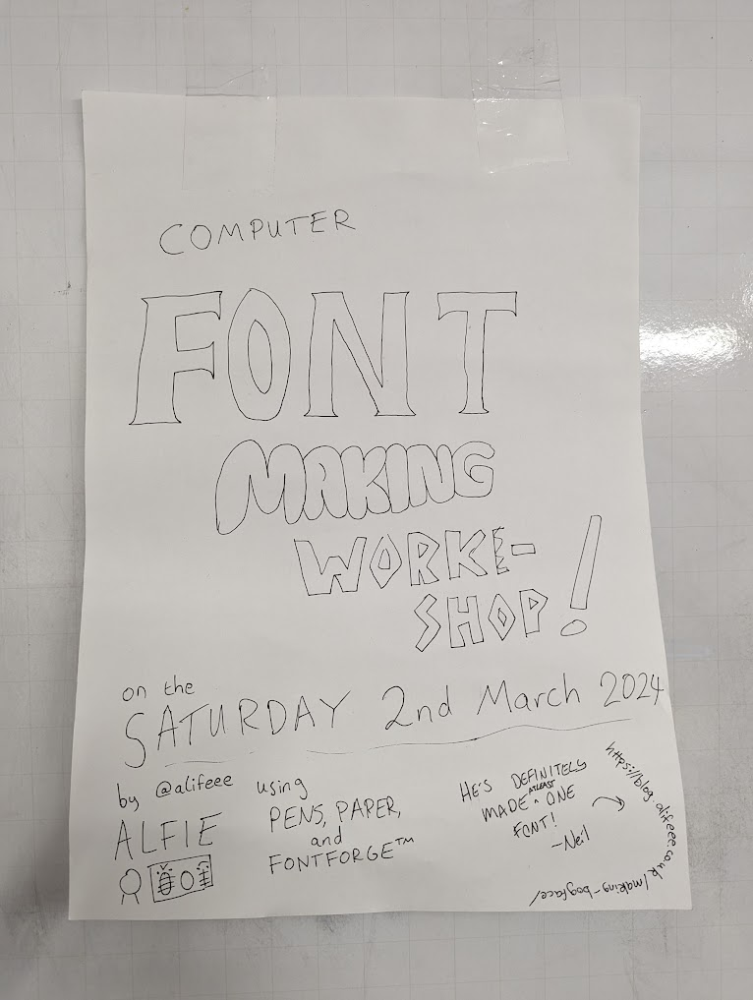

# I ran a computer font-making workshop!

<word-count parent=".markdown-body"></word-count>

## What?

This week I ran a computer font-making workshop at my local hackspace. It was a bunch of fun, and I really enjoyed seeing the creativity come out of people via the medium of creating typefaces.

## Why?

[I like fonts](../making-bogface/)

## Who, Where, When?

I ran the workshop at my local hackspace. I'd seen that they had run workshops before on knife-making and other things, and I thought it would be neat if I did something collective. Often, people are together at the hackspace, which I [enjoy in and of itself](../what-is-a-third-space/). But, it is extra neat if people can be together and all be working on similar things.

About three or four weeks ago, I decided to just "do it", and I made up a sign and put it up at the hackspace.

<figcaption>

Some have pointed out an irony that a poster for a computer font workshop was handwritten...

</figcaption>

As far as I was concerned, "a workshop" was not really an established idea. But that's part of the reason I like community spaces like the hackspace: I can pretend something is an established idea and people will believe it.

I didn't start with a great plan, but rather started by motivating myself to create a plan (by putting up the poster). This turned out to be a nice method of motivation, as I had set a date for my "workshop", which forced me to consider what a "workshop" would involve.

## What does a workshop involve?

I ended up giving a short presentation about why I like fonts, some things to think about when designing a font, and an overview of how to use FontForge, which is the program [that I made BogFace in](../making-bogface/).

### The presentation

I thought about using Google Slides to make a presentation. However, you can't use custom fonts, which was... kind of a killer for a font workshop.

I went with [RevealJS](https://revealjs.com/), which I had seen one of my computer-loving lecturers use at university. It's quite neat to use, mainly because everything is written in HTML. I guess I am fate-bound to never use a WYSIWYG editor again.

The presentation is hosted at <https://alifeee.co.uk/font-workshop/>, but since it is a website, I can also embed it here! Have a scuttle around (press space to ~~slow down~~ progress.)

<iframe
  src="https://alifeee.co.uk/font-workshop/"
  style="width: 100%; height: 100%; min-height: 20rem"
></iframe>

<figcaption>

If I do another workshop in the future, I will probably update this a bit. Depending on what time you exist within at the moment, there could have been any number of updates!

</figcaption>

## What people made

I helped five people make their own fonts. Each one went about it quite (or slightly, depending on how much you care about fonts) differently.

No method was wrong. Some methods were slower, fostering - I think - more appreciation for digital graphic work. All methods were very creative, and it was great to see different ways people went about making a font.

Described briefly, and each description written in their own font, here are the ways people created their fonts:

### Auto-traced handwriting

This font is classic Neil

### Manually traced hand-designed letters

### Designed a Morse code font

### Digitally designed letter forms

### Stroke-expanded lines drawn via touchscreen