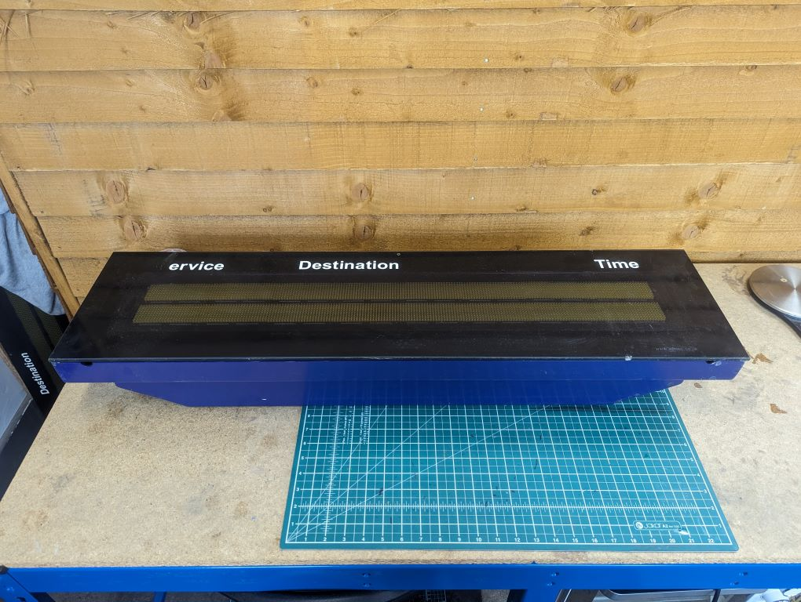
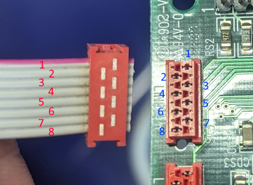
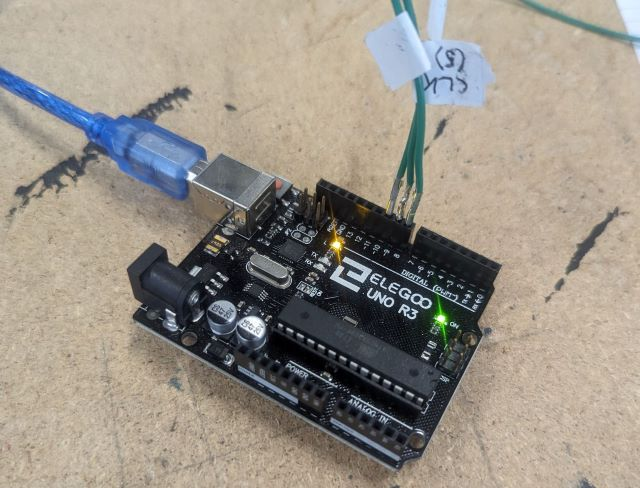
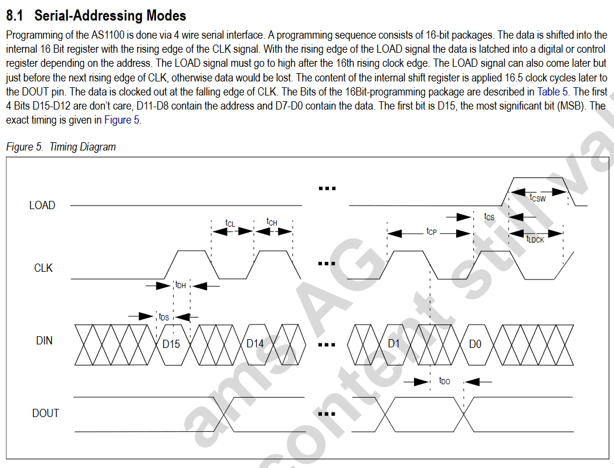

# Hull Bus Terminal Signs: Making Pong on an old Dot-Matrix Display

1. [Introduction](#introduction)
2. [Opening it up](#opening-it-up)
3. [How to connect to a bunch of scary looking electronics](#how-to-connect-to-a-bunch-of-scary-looking-electronics)
   1. [Microchips](#microchips)
   2. [Soldering](#soldering)
   3. [Connected! But it doesn't work](#connected-but-it-doesnt-work)
4. [What is SPI?](#what-is-spi)
   1. [The fix!](#the-fix)
5. [An aside: Neonode touch](#an-aside-neonode-touch)
   1. [The natural conclusion: a theramin](#the-natural-conclusion-a-theramin)
   2. [Theramin + bus sign!](#theramin--bus-sign)
6. [The "Final Project" - Pong!](#the-final-project---pong)
7. [Conclusion](#conclusion)

## Introduction

Several weeks ago I wandered into [Hull Makerspace] to see what it was like. At the time the only Makerspace ([what is a Makerspace?]) I had been to was [fizzPOP] in Birmingham, so I wanted to see what others were like. After reading about computing pedagogy in some [magazines][Hello World magazine] I found, I stumbled across an interesting looking GitHub repository on Hull Makerspace's [linktr.ee][Hull Makerspace] (as of now it's no longer there). It was titled "Bus Terminal Signs" and the initial readme contained only the lines:

`Everything we found out about these signs and Arduino code to drive them`

`This is a work in progress.`

The only thing I knew about "bus terminal signs" was that for a few years, the ones at Hull's bus station were broken, with the solution of printed A4 paper with bus timetables stuck to each door. Eventually, they were replaced by LED screens. (Personally, I think dot matrix displays are great and shouldn't be replaced with the reasoning that they're 'old technology', as commenters suggest [here][Euston departure boards].)

I asked the Makerspace staff and they told me that my suspicions were correct, and when the bus station had ditched the old signs for good, they had asked Hull Makerspace if they wanted the (broken) signs. Of course, they said yes. A year or so ago the Makerspace had given them out to members, but they still had two or three hidden behind some workbenches, so they pulled one out for me behind the scenes. Here it is!

I had a bit of a deeper look into the [`Bus Terminal Signs` GitHub repository][ConnectedHumber/Bus-Terminal-Signs#original] and saw that [Paul Richards] and [Brian Norman] had documented part of their work with the signs, including datasheets, images, and code to interface with the chips on the signs. Knowing what I knew about electronics, C, and hardware, I saw this as a great opportunity for a self-contained and fun project I could work on at the Makerspace! My initial ambitions were that: I wanted to set up the signs myself and get them displaying pixels and/or text; I wanted to document the process a bit more, so that others who had taken signs home could understand more easily how to use them.

The end result was that I improved the original documentation and it is now hosted on the same repository: [ConnectedHumber/Bus-Terminal-Signs]! On there is a step-by-step guide on setting up the signs as well as many images. On the rest of this page, I will go into a bit more depth (and in a bit more of a storytelling theme) on my electronical adventure with the signs :).

## Opening it up

The first step (naturally) was to... take it all apart and look at the wires! With only four allen-key twists, we got the sign open to have a better look inside. Here's what it looks like open, with the LED panels lifted on their hinge:

Inside there are a [lot of electronics][ConnectedHumber/Bus-Terminal-Signs#control-module]. There were two leads coming out of the box: a 3-core power cable; and an Ethernet cable. I had initially considered trying to hack into the Ethernet cable by sending the "correct" requests, and (just) maybe the sign would magically turn on, but I thought better of this idea.

## How to connect to a bunch of scary looking electronics

### Microchips

### Soldering

### Connected! But it doesn't work

<video controls preload="none" poster="./images/videopre_sign_garbage.jpg" loop>
  <source src="./images/videoff_sign_garbage.mp4" type="video/mp4">
</video>

## What is SPI?

### The fix!

<video controls preload="none" poster="./images/videopre_sign_display-test.jpg" loop>
  <source src="./images/videoff_sign_display-test.mp4" type="video/mp4">
</video>

<video controls preload="none" poster="./images/videopre_sign_scrolling-text_fast.jpg" loop>
  <source src="./images/videoff_sign_scrolling-text_fast.mp4" type="video/mp4">
</video>

## An aside: Neonode touch

<video controls preload="none" poster="./images/videopre_neonode_proto.jpg" loop>
  <source src="./images/videoff_neonode_proto.mp4" type="video/mp4">
</video>

### The natural conclusion: a theramin

<video controls preload="none" poster="./images/videopre_neonode_theramin.jpg">
  <source src="./images/videoff_neonode_theramin.mp4" type="video/mp4">
</video>

### Theramin + bus sign!

<video controls preload="none" poster="./images/videopre_both_jumpy-theramin.jpg">
  <source src="./images/videoff_both_jumpy-theramin.mp4" type="video/mp4">
</video>

## The "Final Project" - Pong!

<video controls preload="none" poster="./images/videopre_both_pong.jpg" loop>
  <source src="./images/videoff_both_pong.mp4" type="video/mp4">
</video>

## Conclusion

<!-- links -->
[Hull Makerspace]: https://linktr.ee/makerspacehull
[fizzPOP]: https://fizzpop.org.uk/
[what is a makerspace?]: https://www.makerspaces.com/what-is-a-makerspace/
[Hello World magazine]: https://helloworld.raspberrypi.org/
[Euston departure boards]: https://www.ianvisits.co.uk/articles/euston-station-testing-new-departure-display-boards-58759/
[ConnectedHumber/Bus-Terminal-Signs#original]: https://github.com/ConnectedHumber/Bus-Terminal-Signs/tree/924d6c9f16a497d58154f33e4dc9a63ff28e7344
[Paul Richards]: https://github.com/ConnectedHumber/Bus-Terminal-Signs/blob/924d6c9f16a497d58154f33e4dc9a63ff28e7344/Code/CH_AS1100.cpp#L3
[Brian Norman]: https://github.com/BNNorman
[ConnectedHumber/Bus-Terminal-Signs]: https://github.com/ConnectedHumber/Bus-Terminal-Signs/
[ConnectedHumber/Bus-Terminal-Signs#control-module]: https://github.com/ConnectedHumber/Bus-Terminal-Signs/blob/8442f09b8f9d1832f875e6f604bd82d333bfda3f/pics/Control%20Modules.png
