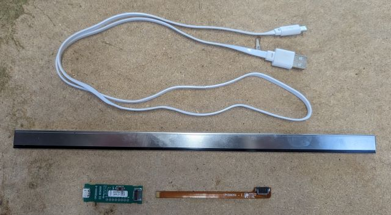
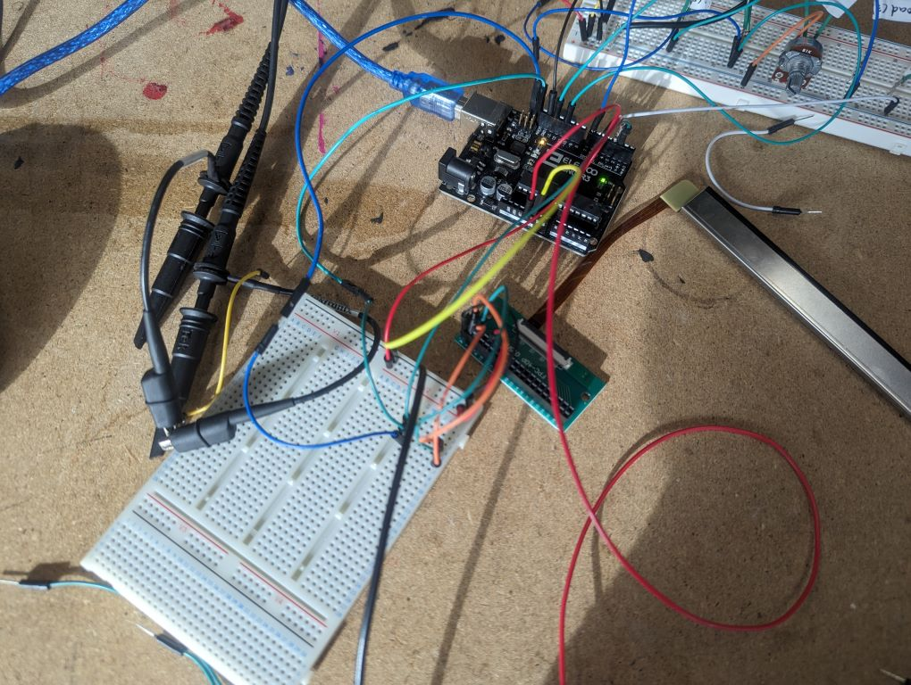

# Neonode Touch

## An aside: Neonode touch

<video controls preload="none" poster="./images/videopre_neonode_proto.jpg" loop>
  <source src="./images/videoff_neonode_proto.mp4" type="video/mp4">
</video>

### The natural conclusion: a theremin

<video controls preload="none" poster="./images/videopre_neonode_theramin.jpg">
  <source src="./images/videoff_neonode_theramin.mp4" type="video/mp4">
</video>

### Theremin + bus sign!

<video controls preload="none" poster="./images/videopre_both_jumpy-theramin.jpg">
  <source src="./images/videoff_both_jumpy-theramin.mp4" type="video/mp4">
</video>
