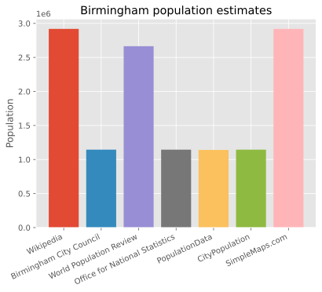
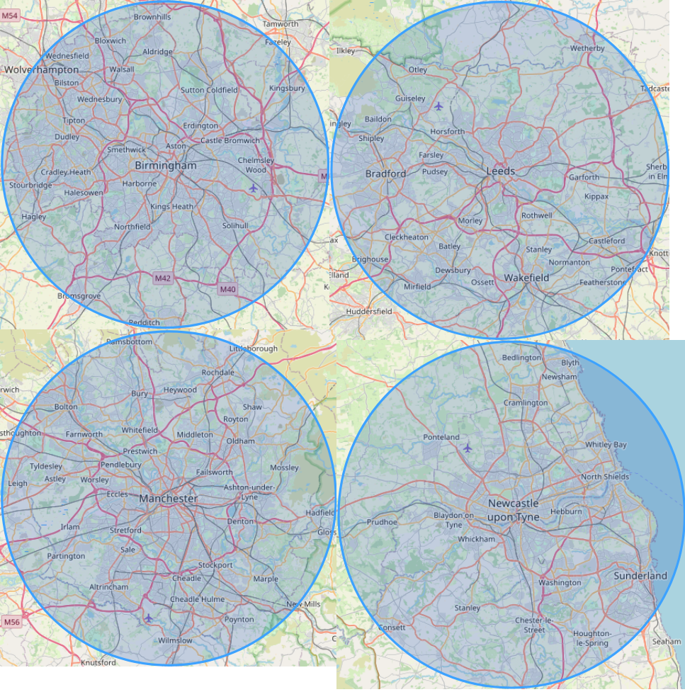

# Ring populations: how to compare cities more agnostically

1. [Internet-Inconsistencies](#internet-inconsistencies)

1. [Let's concentrize!](#lets-concentrize)

    1. [What does 10 km look like?](#what-does-10-km-look-like)

1. [Cities, sorted](#cities-sorted)

1. [Appendix](#appendix)

I love comparing the population of cities. I hate that every city is seemingly measured differently.

How am I supposed to answer my pressing questions like: [is Leeds big enough to deserve a tram][Leeds Supertram]?

[Leeds Supertram]: https://en.wikipedia.org/wiki/Leeds_Supertram

## Internet-Inconsistencies

There would exist no problem if I could search "Birmingham, Alabama population", then "the real Birmingham population" to back up my arguments of why I shouldn't be seeing results for American towns when I'm trying to find a map of bus routes in the real Birmingham (for the results of this search, see lower down).
However, with almost every city I search for population, the top results are from different sources, and the search engines (trying to shave precious seconds off my day) seem to pull their "summary" figure from a different one of these websites for every city.

<figcaption>

"Population of Birmingham" from the first few sources I could find on Google. Presumably the identical ones all use ONS' data, and the others are more 'international' statistics.
[Source](https://github.com/alifeee/blog/blob/main/ring-populations/data/birmingham_pop_from_sources.ipynb).

</figcaption>

## Let's concentrize!

The solution to this problem of inconsistency... is to introduce consistency! Sociologists, anthropologists, and geographists will berate me for this, but my idea was just to draw a circle around the centre[†] of the city and count how many people are inside it.

Here is where I *would* explain the efforts I went through, the technological tools I learnt, and the troubles I faced in writing a simple-to-use website to find the population within a circle. However, the good [Tom Forth] already made this, with his page: [Circle Populations]. Let's use this to take a look at Birmingham.

<figcaption>

As you increase the area you're measuring, population increases, and density decreases! Revolutionary!
[Source](https://github.com/alifeee/blog/blob/main/ring-populations/data/birminghampop-vs-km.ipynb).

</figcaption>

Comparing this with the original plot above, it seems like 10 km is about inline with the ONS data.

<figcaption>

The same graph from above!
This time with the population within a 5/10/15/20 km ring around Birmingham.
New insights? Or content padding?
[Source](https://github.com/alifeee/blog/blob/main/ring-populations/data/birmingham_pop_from_sources.ipynb).

</figcaption>

Thus, I'll stick with 10 km as my favourite circle size. Easy to remember. This may be showing a bit of decimal favouritism, as 10 km seems a nice default type if you use base 10. If the world were ruled by jan Misali, maybe we would end up using 6 km (10 in [seximal]). If the world were ruled by the Mayans, we might use 12 km (10 in [duo-decimal]). In the end, the world was ruled by the French, so 10 it is.

### What does 10 km look like?

If you're aware of "The North", here are some of its gems with a 10 km overlay (and of course, Birmingham). By my eye, it looks like a bigger circle could be misleading in terms of the population it represents, but a smaller one might miss out the context of the city.

For example, I like Newcastle's region including Sunderland, as they're nicely connected by metro. As for Leeds, Bradford, and Wakefield. Well... they *could* be nicely connected by metro.

<figcaption>

Here. Find a city you know a bit. Does 10 km seem a good measure? Would your city be improved with a giant, imposing 10 km circle in the sky?
Screenshots from Tom Forth's [Circle Populations] (circle your own city [there!][Circle Populations]).

</figcaption>

## Cities, sorted

With a metric decided, we can see what the cities of the UK look like! London is, naturally, excluded.

<figcaption>

Ring populations! Tag yourself.
[Source](https://github.com/alifeee/blog/blob/main/ring-populations/data/ukcities.ipynb).

</figcaption>

Nice! Conclusions are free for you to draw.

## Appendix

### Birmingham vs Birmingham

[Above](#internet-inconsistencies), I complained about Birmingham, Alabama vs Birmingham England. With the search terms above, this is what I find the populations to be:

| Source | Birmingham, AL | Birmingham, UK |
| --- | --- | --- |
| Google | 198,000 | 2,660,000 |
| Within 10 km | 267,000 | 1,420,000 |

<figcaption>

Google's population result vs using [Circle Populations].

</figcaption>

### Extra stuff

- [Circle Populations] *also* shows you how many bus, tram, and train/metro stops are in a circle. Very nice for complaining about your city not having trams yet.
- [Tom Forth] has also made [Ring Populations], which is a similar idea to [Circle Populations], but shows the change in population densities and ring populations since 2001 (UK only).

### Data

You can view the code to make the above graphs in the [GitHub repository](https://github.com/alifeee/blog/tree/main/ring_populations)! In particular, check out these Jupyter notebooks:

- [ukcities.ipynb]
- [birminghampop-vs-km.ipynb]
- [birmingham_pop_from_sources.ipynb]

You can open and play with these notebooks on [Binder].

[ukcities.ipynb]: https://github.com/alifeee/blog/blob/main/ring_populations/data/ukcities.ipynb
[birminghampop-vs-km.ipynb]: https://github.com/alifeee/blog/blob/main/ring_populations/data/birminghampop-vs-km.ipynb
[birmingham_pop_from_sources.ipynb]: https://github.com/alifeee/blog/blob/main/ring_populations/data/birmingham_pop_from_sources.ipynb

[Binder]: https://mybinder.org/v2/gh/alifeee/blog/HEAD

### Footnotes

[†]: #footnotes

† - the 'centre' of a city is a pretty arbitrary term, but with the sizes of circles we're working with, and the population density drop-off from the centre, it doesn't really make a difference to the final population count.

[Tom Forth]: https://www.tomforth.co.uk/
[Circle Populations]: https://www.tomforth.co.uk/circlepopulations/
[Ring Populations]: https://www.tomforth.co.uk/ringpopulations/
[seximal]: https://www.seximal.net/
[duo-decimal]: https://en.wikipedia.org/wiki/Duodecimal
