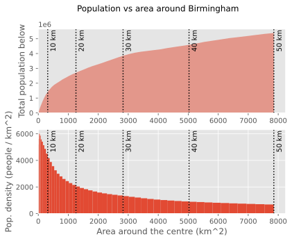

# Ring populations: how to compare cities more agnostically

I love comparing the population of cities. I hate that every city is seemingly measured differently.

How am I supposed to answer my pressing questions like: [is Leeds big enough to deserve a tram][Leeds Supertram]?

[Leeds Supertram]: https://en.wikipedia.org/wiki/Leeds_Supertram

## Internet-Inconsistencies

<figcaption>

As you increase the area you're measuring, population increases, and density decreases! Revolutionary!
[Source](https://github.com/alifeee/blog/blob/main/ring-populations/data.birminghampop-vs-km.ipynb).

</figcaption>

<figcaption>

"Population of Birmingham" from the first few sources I could find on Google. Presumably the identical ones all use ONS' data, and the others are more 'international' statistics.
[Source](https://github.com/alifeee/blog/blob/main/ring-populations/data/birmingham_pop_from_sources.ipynb).

</figcaption>

<figcaption>

The same graph from above!
This time with the population within a 5/10/15/20 km ring around Birmingham.
New insights? Or content padding?
[Source](https://github.com/alifeee/blog/blob/main/ring-populations/data/birmingham_pop_from_sources.ipynb).

</figcaption>

<figcaption>

Here. Find a city you know a bit. Does 10 km seem a good measure? Would your city be improved with a giant, imposing 10 km circle in the sky?
Screenshots from Tom Forth's [Circle Populations] (circle your own city [there!][Circle Populations]).

</figcaption>

[Circle Populations]: https://www.tomforth.co.uk/circlepopulations/
[Ring Populations]: https://www.tomforth.co.uk/ringpopulations/
